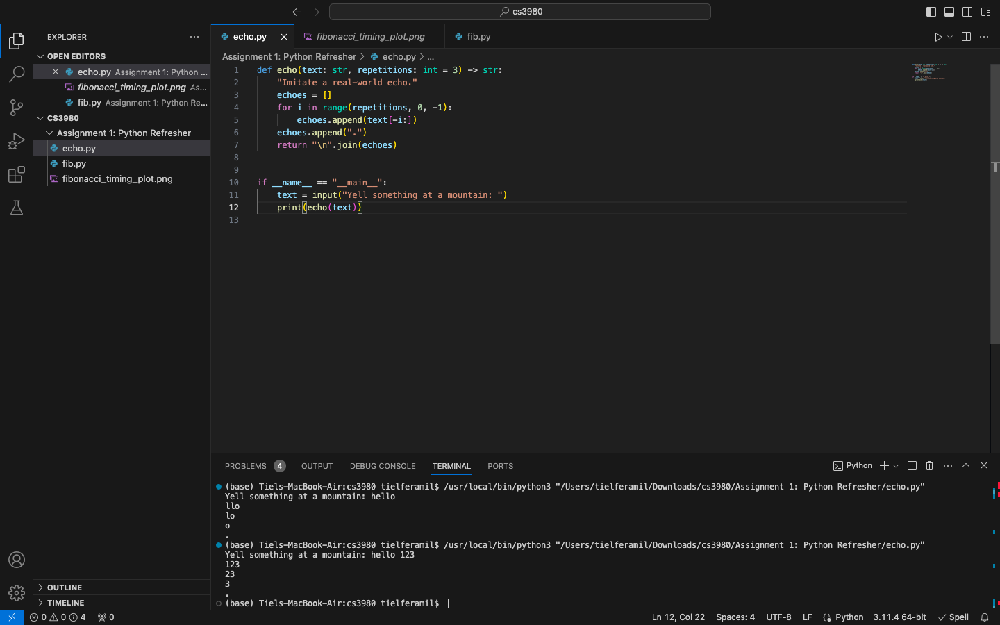
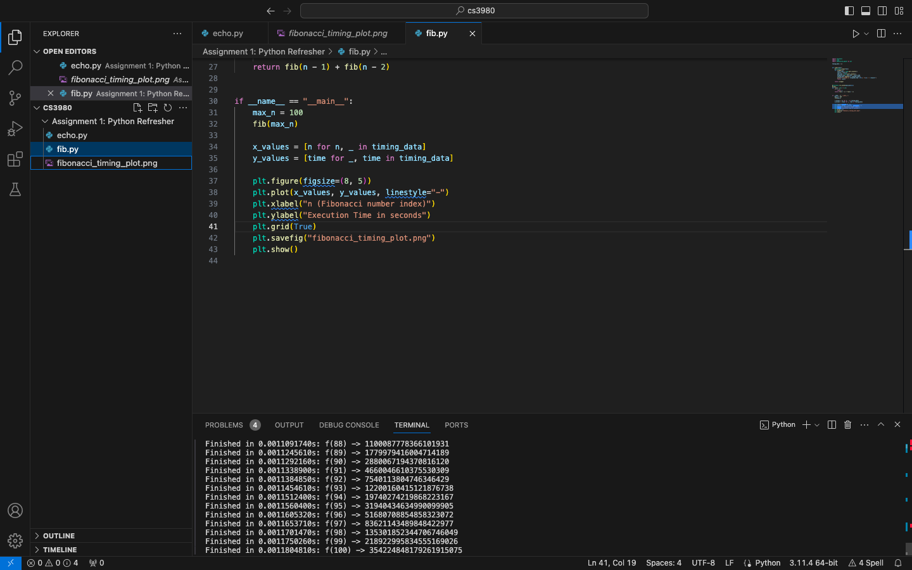
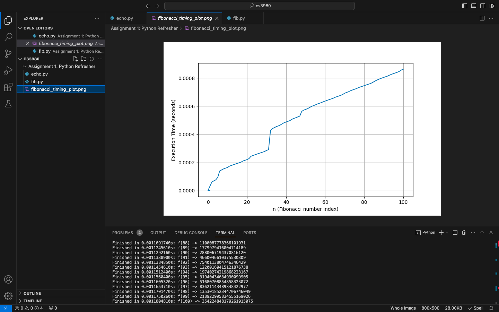

# Assignment-1-Python-Refresher
## Python Programming Basics

## Python Decorator Implementation

## Fibonacci Graph

The y-plot is the time it takes for that point takes to execute. x-plot is the Fibonacci number(n) through 100.
